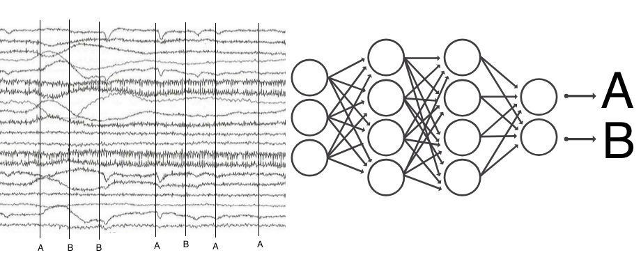

## DeepEEG ##

Goal is to make deep learning stacks that processes generally EEG trials as input and predicts binary trial category as output. This is all made to run on Google Colab notebooks using cloud GPU capabilities, so the git repo's get loaded at the start of the code into the workspace. Minor mods may be needed to use local Jupyter notebook. Long term goal of command line interface and mne toolbox plugin.

Strategy:
* Load in Brain Products files with mne, 
* normal pre-processing to get to trials
* Options for frequency or time domain
* Decimate time to reduce features
* Dataset example: P300 during biking outside? 

API:
* Input the data directory and subject numbers of any eeg-notebook experiment (https://github.com/kylemath/eeg-notebooks)
* Load in .vhdr brain products files
* FeatureEngineer can load any mne Epoch object - https://martinos.org/mne/stable/generated/mne.Epochs.html
* More general with the master eeg-notebooks - https://github.com/NeuroTechX/eeg-notebooks

LearningModels:
* First try basic Neural Network (NN)
* Then try Convolution Neural Net (CNN)
* Then try Long-Short Term Memory Recurrant Neural Net (LSTM, RNN)

DataModels:
* Try subject specific models 
* Then pool data over all subjects
* Then try multilevel models

Using: 
* https://github.com/kylemath/eeg-notebooks
* https://github.com/mne-tools/mne-python
* https://github.com/keras-team/keras/blob/master/examples/imdb_cnn_lstm.py
* https://github.com/ml4a/ml4a-guides/blob/master/notebooks/keras_classification.ipynb
* https://github.com/tevisgehr/EEG-Classification

Resources:
* https://arxiv.org/pdf/1901.05498.pdf 
* http://proceedings.mlr.press/v56/Thodoroff16.pdf
*  https://arxiv.org/abs/1511.06448
*  https://github.com/ml4a
http://oxfordre.com/neuroscience/view/10.1093/acrefore/9780190264086.001.0001/acrefore-9780190264086-e-46
